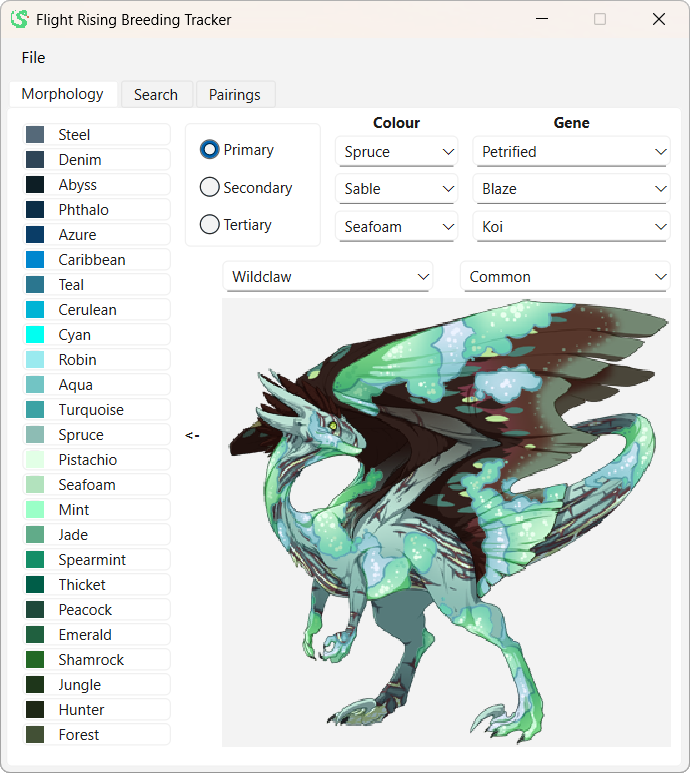

# Flight Rising Breeding Tracker

## Disclaimer

This application doesn't scrape any data from the <a href=https://www1.flightrising.com/>Flight Rising</a> site. All data is input manually.

## Overview

This is a tool that's intended to be an all-in-one for tracking your <a href=https://www1.flightrising.com/>Flight Rising</a> breeding projects :)
First off, a big think you to the team behind <a href=https://www1.flightrising.com/>Flight Rising</a>, and to user Ganondorf for making a very useful <a href=https://www1.flightrising.com/forums/gde/2630512/1>breeding guide</a>!

My main motivation behind building this was how difficult I found it to create dragon searches. I wanted to make searches with only rare genes, only limited or rarer breeds, and colour ranges for each gene! I found that to be a lot of work, so I decided to design the search functionality of this tool. After finishing that off, I realised that I didn't fully understand how to best create a mix of the pyramid and the line breeding methods. So why not write some software that statistically calculates the best way to breed my dragons? That's how I ended up with the Pairings tab.

## Screenshots

Here's the morphology page! You enter information about your dragon here (usually from predict morphology), and use it to search for dragons genetically close to it!